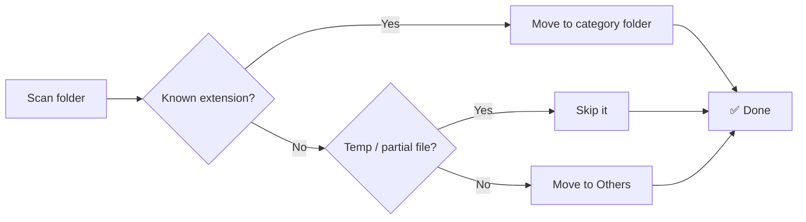

<div align="center">


# 📥 Downloads Organizer

### _Tidy your Downloads folder in one double-click._

<p>
  <a href="https://www.microsoft.com/windows"></a>
  <a href="#"></a>
  <a href="#"></a>
  <a href="#"></a>
</p>

<p>
  
  
  
</p>

**A lightweight, zero-dependency batch script** that instantly transforms a cluttered Downloads folder into a clean, organized structure — no install, no config, no clutter.

<br />

<a href="#quick-start"><kbd>🚀 Quick Start</kbd></a>
<a href="#features"><kbd>✨ Features</kbd></a>
<a href="#category-mapping"><kbd>📋 Categories</kbd></a>

</div>

---

## ✨ Features

<table align="center">
  <tr>
    <td align="center" width="250">
      <br />
      <h3>🚀 One-Click</h3>
      <p>Double-click the script and your folder is organized instantly.</p>
      <br />
    </td>
    <td align="center" width="250">
      <br />
      <h3>📂 Smart Categories</h3>
      <p>8 categories covering 30+ common file types, sorted automatically.</p>
      <br />
    </td>
    <td align="center" width="250">
      <br />
      <h3>🛡️ Non-Destructive</h3>
      <p>Never overwrites existing files — collision-safe by design.</p>
      <br />
    </td>
  </tr>
  <tr>
    <td align="center" width="250">
      <br />
      <h3>🚫 Temp-Aware</h3>
      <p>Skips partial downloads like <code>.crdownload</code>, <code>.part</code>, <code>.tmp</code>.</p>
      <br />
    </td>
    <td align="center" width="250">
      <br />
      <h3>⚡ Zero Deps</h3>
      <p>Pure Windows batch — no Python, no Node, nothing to install.</p>
      <br />
    </td>
    <td align="center" width="250">
      <br />
      <h3>🧩 Customizable</h3>
      <p>Add your own categories and extensions in seconds.</p>
      <br />
    </td>
  </tr>
</table>

---

<a name="quick-start"></a>
## 🚀 Quick Start

| Step | Action |
|:----:|--------|
| **1** | Download `DownloadsOrganizer.bat` |
| **2** | Place it inside the folder you want to organize (e.g. `Downloads`) |
| **3** | **Double-click** — done! |

```
C:\Users\You\Downloads\
├── DownloadsOrganizer.bat   ← drop it here
├── vacation.jpg
├── project.zip
└── report.pdf
```

### 🔄 Before → After

<table align="center">
  <tr>
    <td align="center">
      <strong>BEFORE</strong>
<pre>
Downloads\
 ├ report.pdf
 ├ movie.mp4
 ├ photo.jpg
 ├ song.mp3
 ├ archive.zip
 ├ setup.exe
 └ notes.txt
</pre>
    </td>
    <td align="center">
      <strong>➜</strong>
    </td>
    <td align="center">
      <strong>AFTER</strong>
<pre>
Downloads\
 ├ 📁 Videos/
 ├ 📁 Photos/
 ├ 📁 Documents/
 ├ 📁 Music/
 ├ 📁 Zip/
 ├ 📁 Apps/
 ├ 📁 Txt Files/
 └ 📁 Others/
</pre>
    </td>
  </tr>
</table>

---

<a name="category-mapping"></a>
## 📋 Category Mapping

| 🗂️ Category | 📎 Extensions |
|------------|--------------|
| 📹 **Videos** | `mp4` `mkv` `avi` `mov` `wmv` `flv` `webm` `3gp` |
| 📷 **Photos** | `jpg` `jpeg` `png` `gif` `bmp` `webp` `heic` `svg` |
| 📄 **Documents** | `pdf` `doc` `docx` `xls` `xlsx` `csv` `ppt` `pptx` |
| 🎵 **Music** | `mp3` `wav` `aac` `flac` `m4a` `ogg` |
| 🗜️ **Zip** | `zip` `rar` `7z` `tar` `gz` |
| 📦 **Apps** | `exe` `msi` `apk` |
| 📝 **Txt Files** | `txt` |
| 🗃️ **Others** | Everything else (temp/partial files excluded) |

> 💡 In-progress downloads (`.crdownload`, `.part`, `.tmp`) are **automatically skipped** to prevent corruption.

---

## 🔧 Customization

Edit the `call :m` lines near the top of the script:

```batch
call :m "Videos" mp4 mkv avi mov wmv flv webm 3gp
call :m "Photos" jpg jpeg png gif bmp webp heic svg
REM   ↑ folder        ↑ space-separated extensions
```

Add a new category in one line:

```batch
call :m "Code" py js ts java go rs
```

---

## 🧠 How It Works



1. Scans the current directory for files with recognized extensions
2. Moves matches into category folders (created automatically when needed)
3. Skips any filename that **already exists** — no data loss
4. Sends unrecognized files to `Others`, leaves temp files untouched
5. Skips **itself**, so the script stays put

---

## 📝 Contributing

Issues and pull requests are welcome — new categories and extensions are always appreciated.

## 📄 License

Released under the [MIT License](LICENSE).

---

<div align="center">

Made with ❤️ for a cleaner `Downloads` folder.

<sub>Windows · Batch · Zero Dependencies</sub>

</div>
